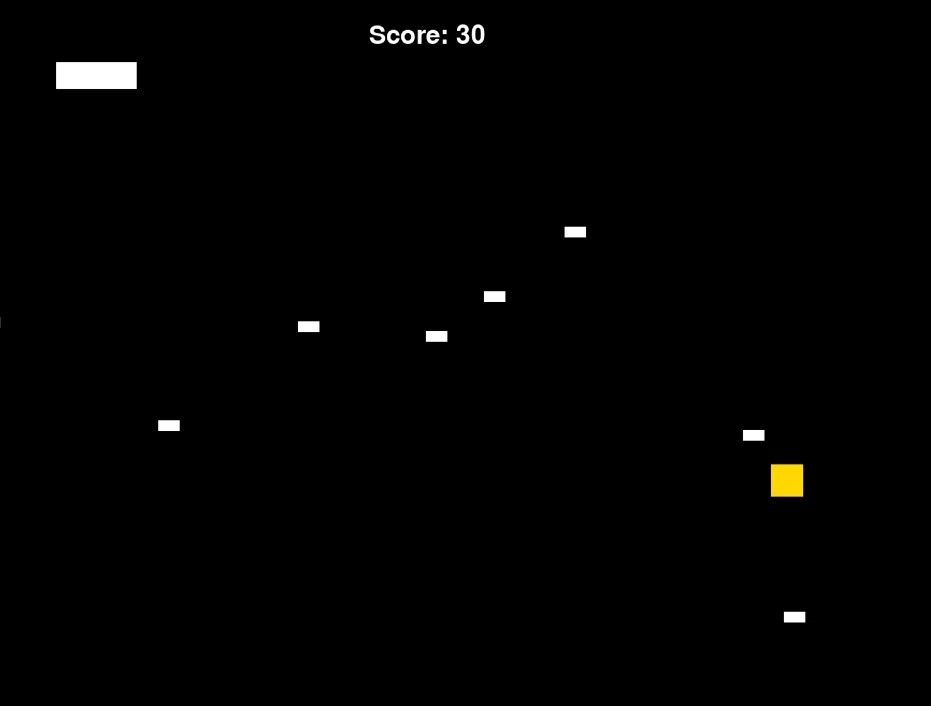

# BulletHeck

A single-screen bullet-hell style game, in which you try to collect the gold cubes while avoiding the--astroids? enemy ships? missiles? coming your way. Graphics are still just block sprites at this point, so feel free to use your imagination. Obstacle sprites gain speed and frequency the longer you place. Arrow buttons to move, space to restart after game-over, esc to quit.

Programmed in Python using Pygame.

